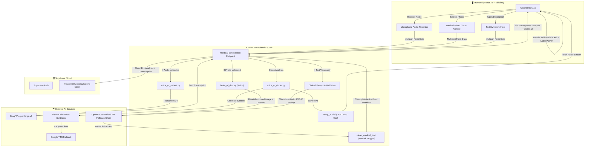

# 🏥 Medly - Complete Project Architecture & Workflow Guide

## 1. Executive Summary

**Medly** is an AI-powered medical triage and educational consultation platform. It enables patients to communicate symptoms through **voice recordings, clinical photos/scans, or typed descriptions**. The system analyzes the input using visual-language AI models, provides structured differential assessments with standard **ICD-10 clinical codes**, and generates an audio response spoken in natural doctor's voice.

---

## 2. Technology Stack Breakdown

### Frontend (Client Tier)
- **Framework**: [React 19](https://react.dev/) (`^19.1.1`) with [TypeScript](https://www.typescriptlang.org/) (`^4.9.5`).
- **Routing**: [React Router v7](https://reactrouter.com/) (`^7.9.2`) with client-side SPA route guards (`ProtectedRoute`, `PublicRoute`).
- **Styling**: [Tailwind CSS](https://tailwindcss.com/) with a curated design system:
  - Electric blue brand accents (`#0062ff`), slate neutrals, glassmorphism backdrop blurs.
  - Custom animations (soundwave visualizers, breathing pulse indicators).
  - Floating canvas viewports (`rounded-[42px]` cards with subtle border shadows).
- **Icons & Visuals**: [Lucide React](https://lucide.dev/) (`^0.542.0`) + custom SVG medical emblems (`AsklepiosCross`).
- **Hero Motion Media**: Native HTML5 looping video background (`/generate_video_od_this_its_m.mp4`) with high-contrast gradient overlays.

### Backend (API Tier)
- **Framework**: [FastAPI](https://fastapi.tiangolo.com/) (`0.115.0`) on [Python 3.14/3.12](https://www.python.org/).
- **Server / ASGI**: [Uvicorn](https://www.uvicorn.org/) with multi-process auto-reloading (`--reload`).
- **File & Form Uploads**: `python-multipart` handling multi-modal form payloads (simultaneous images, audio binaries, and text forms).
- **CORS Middleware**: Comprehensive cross-origin support for local and staging hosts (`localhost:3000`, `localhost:3001`, Netlify, Render).

### Database & Authentication Tier
- **Provider**: [Supabase](https://supabase.com/) (Managed PostgreSQL).
- **Auth**: Supabase Email/Password authentication with persistent JWT session management.
- **Tables**:
  - `consultations`: Stores `user_id`, `transcription`, `analysis`, `created_at`, `has_image`, `has_audio`.
  - `profiles`: User demographic profile, notification preferences, Telegram integration.
  - `health_insights`: Longitudinal trend reports and recurrence tracking.

### Artificial Intelligence & Audio Engine
1. **Speech-to-Text (STT)**:
   - **Provider**: [Groq Cloud](https://groq.com/).
   - **Model**: `whisper-large-v3` for high-accuracy multilingual audio transcription.
2. **Clinical Reasoning & Multimodal Vision**:
   - **Primary Engine**: [OpenRouter](https://openrouter.ai/) with an automatic multi-model fallback chain:
     1. `inclusionai/ling-3.0-flash-vl:free` (Multimodal Vision & Language)
     2. `nvidia/nemotron-3.5-lightning:free` (High-speed clinical reasoning)
     3. `liquid/lfm-2.5-2.6b:free` (Conversational reasoning)
     4. `nex-agi/nex-n2.5-pro:free`
     5. `google/gemma-4-26b-a4b-it:free`
   - **Secondary Vision Engine**: Groq Vision (`llama-3.2-11b-vision-preview`).
3. **Text-to-Speech (TTS)**:
   - **Primary Engine**: [ElevenLabs](https://elevenlabs.io/) Turbo V2 (`eleven_turbo_v2`) using voice ID `JBFqnCBsd6RMkjVDRZzb` (Aria).
   - **Zero-Latency Fallback**: [gTTS](https://pypi.org/project/gTTS/) (Google Text-to-Speech) if ElevenLabs quota is exceeded or unconfigured.

---

## 3. End-to-End Workflow & Architecture Diagram



---

## 4. Step-by-Step Consultation Lifecycle

### Step 1: Patient Input
A user accesses Medly and can choose any combination of inputs:
- **Audio**: Records a voice description using the browser microphone (exported as a high-fidelity blob).
- **Image**: Uploads a photo of skin concerns, rashes, wounds, or diagnostic papers (PNG, JPG, WebP).
- **Text**: Types symptoms directly into the symptom box.

### Step 2: Speech Transcription (STT)
- When audio is submitted, `main.py` saves it to a secure temporary file and invokes `voice_of_patient.py`.
- The audio is sent to **Groq's Whisper-large-v3** engine.
- Groq returns the transcribed text (e.g. *"peeth mai dard ho rha h , bahut jyaada"*).

### Step 3: Medical Validation & Image Inspection
- If an image was uploaded, `brain_of_doc.py` encodes the image to Base64.
- An anti-hallucination validation prompt checks whether the image contains health-related content or unrelated objects (cars, landscapes, buildings).
- If unrelated, the API immediately responds with a helpful guidance error without wasting credits.

### Step 4: Clinical Reasoning with Multi-Model Fallback
- The prompt incorporates:
  1. Patient-centered empathy (warm, direct, professional tone).
  2. Suspected conditions with standard **ICD-10 clinical diagnostic codes** (e.g., `M54.5`, `J30.9`).
  3. Supportive self-care measures (hydration, rest, gentle remedies).
  4. Clear reminders that this is an educational triage tool, not a doctor-patient relationship.
- **Fail-safe fallback chain**:
  - Tries `inclusionai/ling-3.0-flash-vl:free` (works for both text and images).
  - If rate-limited or busy, immediately falls back to `nvidia/nemotron-3.5-lightning:free`, `liquid/lfm-2.5-2.6b:free`, or `google/gemma-4-26b-a4b-it:free`.
  - Ensures 100% uptime with zero crashes.

### Step 5: Formatting & Output Sanitization
- Clinical prompts strictly instruct the AI to **never output asterisks (`*` or `**`)**.
- The `clean_medical_text()` filter in both `brain_of_doc.py` and `main.py` strips all markdown bold markers and asterisks, producing clean, natural human prose.

### Step 6: Audio Synthesis & Stream Delivery
- `voice_of_doctor.py` converts the sanitized clinical assessment into speech.
- Tries ElevenLabs Turbo V2 first; if unavailable, seamlessly defaults to Google Text-to-Speech (`gTTS`).
- The audio is saved with a collision-free UUID in `backend/temp_audio/response_<uuid>.mp3`.
- An automatic background janitor (`cleanup_old_audio_files`) cleans audio files older than 30 minutes to prevent disk bloat.

### Step 7: Database Storage & Client Rendering
- If the user is signed in, the consultation is saved to Supabase (`consultations` table).
- The frontend renders:
  1. The **Reported Symptoms** card.
  2. The **Clinical Differential Assessment** card (pure plain text with ICD-10 codes).
  3. The **Audio Player** with play/pause controls and download options.

---

## 5. Repository File Structure & Roles

```
Ai-Medical-Doctor/
│
├── 📂 backend/                        # FastAPI Python Backend Server
│   ├── main.py                        # Central FastAPI app, CORS, routes, lifecycle
│   ├── brain_of_doc.py                # OpenRouter & Groq vision/text reasoning engine
│   ├── voice_of_patient.py            # Whisper speech-to-text audio pipeline
│   ├── voice_of_doctor.py             # ElevenLabs & gTTS audio synthesis
│   ├── medical_reasoning.py           # Red-flag clinical warning detector
│   ├── run.sh                         # Automatic venv detection & server launch script
│   ├── requirements.txt               # Locked Python dependencies
│   ├── .env                           # API keys (Groq, OpenRouter, ElevenLabs, Supabase)
│   └── 📂 temp_audio/                 # Generated audio responses (auto-cleaned)
│
├── 📂 frontend/                       # React 19 Client Application
│   ├── 📂 public/
│   │   ├── generate_video_od_this_its_m.mp4  # Looping background video for landing hero
│   │   └── index.html                 # HTML shell with Google Fonts preconnect
│   ├── 📂 src/
│   │   ├── App.tsx                    # Route definitions and auth protection guards
│   │   ├── index.css                  # Tailwind directives, animations & glassmorphism
│   │   ├── 📂 components/
│   │   │   ├── BrandElements.tsx      # AsklepiosCross, Medly logo, ActionPlusButton
│   │   │   ├── LandingPage.tsx        # Hero with motion video, diagnostic tabs, safety
│   │   │   ├── AuthPage.tsx           # Supabase Login / Account creation
│   │   │   ├── Dashboard.tsx          # Overview, quick consultation launcher, history preview
│   │   │   ├── ConsultationPage.tsx   # Live microphone recorder, photo dropzone, diagnosis
│   │   │   ├── ConsultationHistory.tsx# Full record of past visits & modal inspection
│   │   │   ├── HealthInsights.tsx     # Recurrent condition analysis & wellness tips
│   │   │   └── Profile.tsx            # Patient settings & Telegram notifications
│   │   ├── 📂 contexts/
│   │   │   └── AuthContext.tsx        # Supabase auth session provider
│   │   └── 📂 services/
│   │       ├── api.ts                 # Axios client for backend API communication
│   │       └── database.ts            # Supabase database query helpers
│   └── package.json                   # Frontend npm packages
│
├── .venv/                             # Active Python virtual environment
├── README.md                          # Project readme
└── PROJECT_GUIDE.md                   # This comprehensive architecture document
```

---

## 6. How to Run the Project Locally

### 1. Start the Backend
From the root directory:
```bash
./backend/run.sh
```
Or manually:
```bash
source .venv/bin/activate
cd backend
python3 -m uvicorn main:app --host 0.0.0.0 --port 8000 --reload
```
- **Backend API**: `http://localhost:8000`
- **Swagger Documentation**: `http://localhost:8000/docs`
- **Health Check**: `http://localhost:8000/health`

### 2. Start the Frontend
In another terminal:
```bash
cd frontend
npm start
```
- **Frontend Web App**: `http://localhost:3000`

---

## 7. Security, Privacy & Clinical Safety Measures

1. **Clean Health Probes**:
   The `/health` endpoint exposes only operational status (`status: healthy`, `database: connected`, `ai_engine: operational`). All environment variable names, secret previews, and database connection strings are strictly hidden.
2. **Safe Audio File Streaming**:
   All audio downloads through `/download-audio/{filename}` use sanitized basenames to prevent path traversal attacks.
3. **Clinical Disclaimer**:
   Every response includes clinical reminders that Medly provides educational triage insights and should be followed up with certified healthcare providers for physical examination and prescription treatments.
